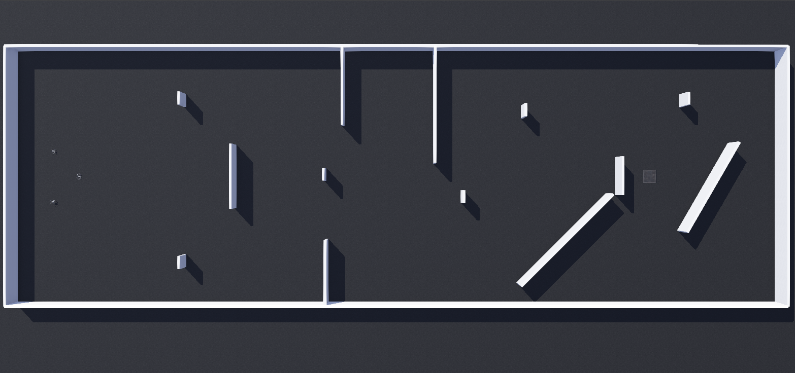

# Formation Flight of UAV Swarms in an Obstacle Filled Three-Dimensional Environment

This project showcases the formation flight of a group of unmanned aerial vehicles
avoiding obstacles while navigating and maintaining the formation. This project
uses Cyberbotic's Webots to simulate the drones and physics.

The project is my Honors Project for the Bachelor of Computer Science Honors at
Carleton University.

## Abstract

*Pattern formation for swarms of robots is a novel problem in the field of robotics
with many useful use cases, especially for swarms of UAVs. In this report we 
present a solution we developed for this problem using a leader-follower approach, 
where the leader decides the position the followers needs to reach, and we pair it 
with the path planning algorithm Field D Star, to allow a swarm of UAVs to navigate an 
obstacle course while maintaining a certain formation. We finally test our solution 
in two scenarios to demonstrate that our solution works, albeit with some issues
pertaining to the precision of the UAV's movements and the leader-follower paradigm.*

## Dependencies

The project consists of controllers and example worlds for Cyberbotic's
Webots, so, in order for the project to work, you will need to download
Webots. You can find the latest release on their
[GitHub repository](https://github.com/cyberbotics/webots).

To compile the report you will need LaTeX as well as Inkscape for the SVG
images. Or a pre-compiled version is located in the `report/` directory.

## Usage

To see the progress so far import the project directory into Webots
and open the `obstacle_avoidance_test.wbt` or the `formation_test.wbt` world file.
Then compile the `uav_controller`:

- Cd to `Honours-Project/controller/uav_controller` directory
- Execute the `setup.sh` file
- Run `make`

Finally, run the simulation in Webots.

## Documentation

You can have a look at the report in the report folder or to the additional code documentation by
executing `make documentation` in the root directory of the project (**NOTE:** this requires Doxygen to work).
The documentation will be generated in the `doc/` directory.
You can access the documentation on the browser by opening the file `html/index.html` or you can generate a 
PDF by running `make` in the `latex/` folder. The PDF file name is `refman.pdf`. A pre-generated version
is located in the `doc/` directory.
